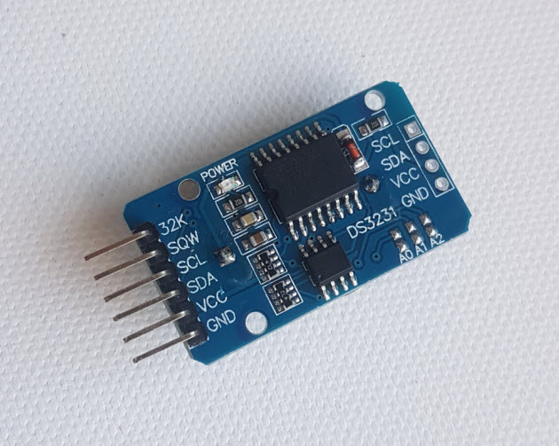

# DS3231

## MakeCode DS3231 RTC Extension for micro:bit

Author: Alexandre Frolov





## Add extension

Copy and paste this to Extension search box:
https://github.com/AlexandreFrolov/DS3231

## Usage:


* set Time hours, minutes and seconds

```blocks
setTime(hour: number, mins: number, secs: number)

input.onButtonPressed(Button.A, function () {
    DS3231.setTime(11, 10, 50)
})

```

* set Date day, month and year

```blocks
setDate(weekday: number, day: number, month: number, year: number)

input.onButtonPressed(Button.A, function () {
    DS3231.setDate(2, 28, 7, 2020)
})

```

* show Time as a String

```blocks
function timeString()

function doTest () {
    OLED.writeStringNewLine(DS3231.timeString())
}
```

* show Date as a String

```blocks
function dateString()

function doTest () {
    OLED.writeStringNewLine(DS3231.dateString())
}
```

* set Alarm 1

```blocks
alarm1(hour: number, mins: number, secs: number)

input.onButtonPressed(Button.B, function () {
    DS3231.alarm1(11, 10, 30)
    doTest()
    basic.showIcon(IconNames.Diamond)
})
```

* set Alarm 2

```blocks
alarm2(hour: number, mins: number)

input.onButtonPressed(Button.B, function () {
    DS3231.alarm2(11, 11)
    doTest()
    basic.showIcon(IconNames.Diamond)
})
```

* clear Alarms

```blocks
clearAlarms()

input.onButtonPressed(Button.AB, function () {
    DS3231.clearAlarms()
    basic.clearScreen()
    doTest()
})
```


* show Time and Date as a numbers

```blocks
```

## License

Apache

## Supported targets

* for PXT/microbit
(The metadata above is needed for package search.)

